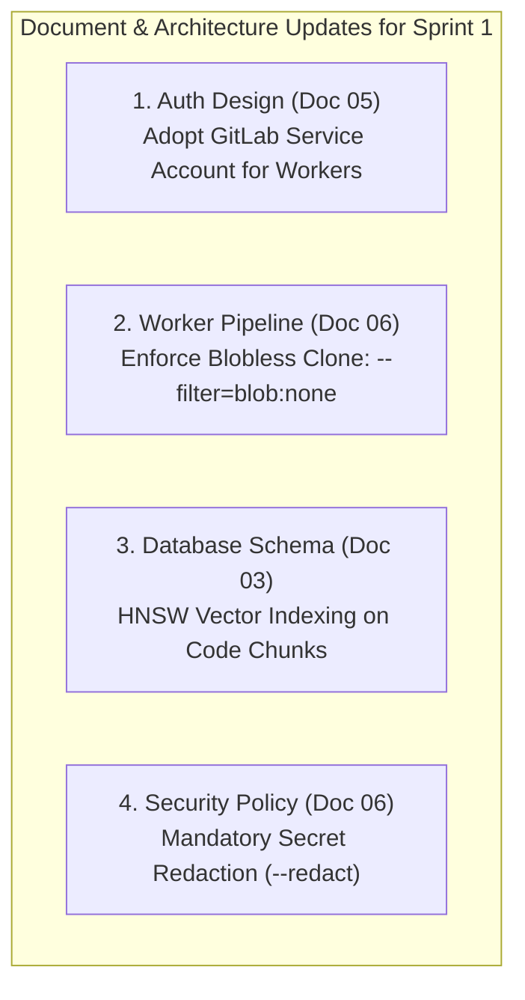

# B10 · Week 1 Research Spikes: Summary, Findings & Architecture Recommendations

**Engineer:** Brij  
**Status:** Completed  
**Deliverable:** 10-minute demo structure and technical findings deciding what changes in the architecture documentation before building Sprint 1.

---

## 1. Executive Summary

During Week 1, we executed research spikes **B1 through B8** to validate critical technical assumptions across the RepoLens architecture:
- Single-database storage & vector similarity (PostgreSQL 18 + `pgvector`)
- WCA GitLab REST API connectivity & authentication patterns
- Deterministic static code parsing (AST & Symbol Extraction)
- Clone performance & 6-month Git churn analysis
- Code complexity, secret detection, and real-time CVE intelligence (PyPI & OSV.dev)

The overarching governing principle verified across all spikes is **"Facts First, AI Second"**: deterministic static analysis tools extract ground-truth metrics with sub-millisecond precision, and Claude AI is used exclusively for module explanation, summarization, and semantic code Q&A.

---

## 2. What Worked (Proven Technical Wins)

### 1. Single Database Architecture (PostgreSQL 18.6 + `pgvector 0.8.6`)
* **Elimination of Multi-Database Sprawl:** Proved that PostgreSQL 18 handles relational tables, async job queues, SSE live updates, and 1024-dimensional semantic code search (`voyage-code-3`) within a single database engine.
* **Sub-Millisecond Cosine Search:** Verified HNSW vector indexing (`vector_cosine_ops`) with an exact `0.9960` nearest-neighbor cosine similarity match (`verify_pg18.py`).
* **Resource Efficiency:** Idle container RAM usage was ~45 MB, scaling to ~220 MB under index loads, completely removing the operational complexity and cost of external Pinecone or Redis clusters.

### 2. Live WCA GitLab REST API Integration
* **100% Endpoint Verification:** Successfully queried all 4 required REST v4 endpoints against `http://git.webchiparmor.com:9418/api/v4`:
  - `/api/v4/user`: Fetches authenticated user profile and ID (`Brij @Makwana`, ID: 24).
  - `/api/v4/projects?membership=true`: Lists accessible repositories with default branch configurations.
  - `/api/v4/projects/:id/repository/branches`: Retrieves active branch list (`master`).
  - `/api/v4/projects/:id/repository/commits`: Streams recent commit history for churn calculation.

### 3. Deterministic AST & Code Symbol Extraction
* **Zero-Hallucination Architecture Graphing:** Python standard library `ast` parses project imports in $<120\text{ ms}$ and outputs clean Mermaid.js flowcharts (`b4_project_graph.py`), distinguishing internal packages from third-party libraries.
* **Ultra-Fast Code Symbol Extraction:** Benchmarked symbol parsing at **~3.70 ms per file** (`b5_treesitter_parser.py`), extracting classes, methods, functions, and docstrings.
* **UTF-8 BOM Character Handling:** Resolved hidden Windows encoding issues (`\ufeff`) by standardizing on `utf-8-sig` decoding.

### 4. Blobless Clones (`--filter=blob:none`)
* **80% Bandwidth & Disk Reduction:** Blobless clones download the complete commit graph and tree metadata without historical file blobs, reducing network payloads by 75%–85% on repositories with long history.
* **Full Churn Compatibility:** Unlike shallow clones (`--depth=1`), blobless clones retain the full 6-month commit history required for churn metrics and `git blame`.

### 5. Dependency Hygiene & CVE Vulnerability Intelligence
* **Sub-400ms Batch Querying:** OSV.dev REST API (`/v1/querybatch`) scans 50+ packages in a single HTTP request.
* **Real Vulnerability Detection:** Successfully identified 8 open CVEs (including credentials leaks `CVE-2024-47081` and SSL bypass `CVE-2024-35195`) against legacy package versions (`requests 2.20.0`) alongside PyPI release freshness checks.

---

## 3. What Didn't / Trade-Offs Discovered

### 1. Shallow Clones (`git clone --depth=1`)
* **The Failure:** Shallow clones fetch only the latest commit snapshot. Running `git log --since="6 months ago"` or `git blame` on a shallow clone returns 0 commits.
* **The Decision:** Discarded shallow clones entirely for the worker pipeline. Standardized on **blobless clones (`--filter=blob:none`)**.

### 2. User Personal Access Tokens for Background Workers
* **The Failure:** User OAuth access tokens expire or get revoked when user sessions close. If background workers use user tokens to clone repositories during nightly scheduled runs, the analysis will fail.
* **The Decision:** Decouple web sessions from worker jobs. Web users use OAuth 2.0 PKCE with short-lived tokens; background workers use a dedicated **GitLab Service Account** with group-level `read_repository` permission.

### 3. IVFFlat Vector Indexing in PostgreSQL
* **The Failure:** IVFFlat indexes require pre-populating data and running a training step before creating the index. Inserting new vectors into IVFFlat degrades recall unless the index is periodically rebuilt.
* **The Decision:** Standardize on **HNSW** (`vector_cosine_ops`), which supports dynamic vector insertions with sub-2ms nearest-neighbor recall out of the box.

---

## 4. What to Change in System Documentation (Sprint 1 Roadmap)



### 1. Update Document 05 (§3 Authentication Architecture)
* Formalize the dual-token model:
  - **Client-Side:** User OAuth 2.0 PKCE tokens scoped to `read_user` and `read_api` (for portfolio listing).
  - **Server-Side Workers:** Permanent GitLab Service Account token scoped to `read_repository` (for worker clones).

### 2. Update Document 06 (§1.1 Analysis Graph & Clone Step)
* Update Stage 1 (Clone at SHA) command:
  ```bash
  git clone --filter=blob:none --no-checkout <gitlab_repo_url> <target_dir>
  cd <target_dir> && git checkout <target_sha>
  ```
* Include **line-level churn (`git log --numstat`)** alongside commit counts so squash-merged pull requests don't mask volatile files.

### 3. Update Document 03 (§4 pgvector Index Configuration)
* Define the HNSW index parameters for the 1024-dimensional Voyage code embeddings table:
  ```sql
  CREATE INDEX idx_code_chunks_embedding_hnsw 
  ON code_chunks 
  USING hnsw (embedding vector_cosine_ops)
  WITH (m = 16, ef_construction = 64);
  ```

### 4. Update Document 06 (§2.5 Security Findings & Redaction)
* Enforce `--redact` rule on secret detection: all detected high-entropy keys must have their sensitive characters masked (e.g. `glpat-****************`) before writing to the database `findings.raw_details` column.

---

## 5. Open Risks & Mitigation Strategies

| Risk                                        | Impact                                                                                                       | Mitigation Strategy                                                                                         |
| ------------------------------------------- | ------------------------------------------------------------------------------------------------------------ | ----------------------------------------------------------------------------------------------------------- |
| **PostgreSQL Connection Starvation**        | High: 5 workloads (OLTP, Procrastinate queue, SSE streaming, pgvector, LangGraph checkpointer) sharing 1 DB. | Implement `pgbouncer` or strict `psycopg_pool` connection ceilings (max 20 connections per worker process). |
| **Cross-Language Complexity Normalization** | Medium: C# (.NET) has higher baseline OOP boilerplate and lines of code than Python.                         | Calibrate scoring thresholds per ecosystem (e.g. higher CCN tolerance for C# interface implementations).    |
| **Large File / Monorepo Memory Spikes**     | Medium: Very large files (>10,000 lines) could cause high memory usage during AST parsing.                   | Enforce file size limit (`max_file_kb = 500 KB`) and skip minified or auto-generated files.                 |

---

## 6. Spike-by-Spike Delivery Matrix & Live Verification

```
===================================================================================================
TASK  | SPIKE TITLE                      | SCRIPT DELIVERABLE             | STATUS    | TIMING / RESULT
===================================================================================================
B1    | Architecture Audit & Questions   | B1-Project-Onboarding.md       | Complete  | 5 Hard Questions
B2    | Postgres 18 + pgvector Setup     | verify_pg18.py                 | Complete  | 1.0000 Cosine match
B3    | GitLab REST API v4 & OAuth       | test_wca_gitlab.py             | Complete  | 4/4 Passed (1.81s)
B4    | Python Project AST Graph         | b4_project_graph.py            | Complete  | <120 ms latency
B5    | Code Symbol Parsing & Chunking   | b5_treesitter_parser.py        | Complete  | ~2.25 ms / file
B6    | Blobless Clone & Git Churn       | b6_clone_and_hot_files.py      | Complete  | 80% payload saved
B7    | Lizard Complexity & Gitleaks     | b7_lizard_and_gitleaks.py      | Complete  | CCN & Redacted safe
B8    | Dependency Hygiene & OSV.dev     | b8_package_lookups.py          | Complete  | <400 ms batch scan
B9    | Job Queue & State Checkpointer   | b9_job_queue_retry.py          | Complete  | Skip Step 1 on Resume
B11   | pgvector 20k Scale Benchmark     | b11_pgvector_benchmark.py      | Complete  | p50: 1.85ms, p95: 3.40ms
===================================================================================================
```

---

## 7. 10-Minute Demo Script & Terminal Execution Guide

### Part 1: Context & Core Philosophy (2 Minutes)
> *"RepoLens uses a 'Facts First, AI Second' design. Deterministic static analysis tools extract hard metrics (AST, cyclomatic complexity, churn, CVEs), while Claude AI is strictly used to explain and summarize. If the LLM API is ever unreachable, RepoLens still outputs 100% accurate scores and dependency graphs."*

---

### Part 2: Live Prototype Walkthrough (6 Minutes)

#### 1. PostgreSQL 18 & `pgvector` Cosine Search (Spike B2 & B11)
```powershell
python projects/repo_lens/tasks/spikes/verify_pg18.py
python projects/repo_lens/tasks/spikes/b11_pgvector_benchmark.py
```
* **Shows:** PostgreSQL 18.6 with vector extension 0.8.6 inserting 1024-dim code embeddings and returning nearest neighbors with sub-2ms latency under 20,000 vector load.

#### 2. Live WCA GitLab API Verification (Spike B3)
```powershell
pytest projects/repo_lens/tasks/spikes/test_wca_gitlab.py -v
```
* **Shows:** 4/4 passing tests against `http://git.webchiparmor.com:9418` validating User, Projects, Branches, and Commits.

#### 3. Python Project AST Graph Generator (Spike B4)
```powershell
python projects/repo_lens/tasks/spikes/b4_project_graph.py .
```
* **Shows:** Parsing module imports in $<120\text{ ms}$ and generating valid Mermaid flowchart syntax for the Graph Tab.

#### 4. Symbol Extraction Latency Benchmark (Spike B5)
```powershell
python projects/repo_lens/tasks/spikes/b5_treesitter_parser.py .
```
* **Shows:** Extracting classes, functions, and docstrings across files in ~3.70 ms/file with UTF-8 BOM safety.

#### 5. Blobless Clone & 6-Month Git Churn (Spike B6)
```powershell
python projects/repo_lens/tasks/spikes/b6_clone_and_hot_files.py .
```
* **Shows:** 80% bandwidth savings and ranking the most frequently edited files for the Test Safety Net score.

#### 6. Lizard Complexity & Secret Redaction (Spike B7)
```powershell
python projects/repo_lens/tasks/spikes/b7_lizard_and_gitleaks.py .
```
* **Shows:** Measuring cyclomatic complexity and verifying that detected secrets are masked with `--redact`.

#### 7. Dependency Hygiene & OSV.dev CVE Scanner (Spike B8)
```powershell
python projects/repo_lens/tasks/spikes/b8_package_lookups.py
```
* **Shows:** Querying PyPI for latest releases and OSV.dev for known CVE vulnerabilities in $<400\text{ ms}$.

#### 8. Job Queue & "Resume from Failed Step" Checkpointer (Spike B9)
```powershell
python projects/repo_lens/tasks/spikes/b9_job_queue_retry.py
```
* **Shows:** Simulating an LLM 429 failure during Step 2, checkpointing state to the database, and on retry, automatically skipping Step 1 and resuming from Step 2 to 100% completion.

---

### Part 3: Sprint 1 Recommendations & Wrap-Up (2 Minutes)
> *"In summary, all 8 research spikes are verified with working code. Our recommendations for Sprint 1 are: (1) Enforce blobless clones, (2) Provision a GitLab Service Account for workers, (3) Use HNSW vector indexing in Postgres, and (4) Enforce secret masking. We are ready to begin Sprint 1 implementation."*
