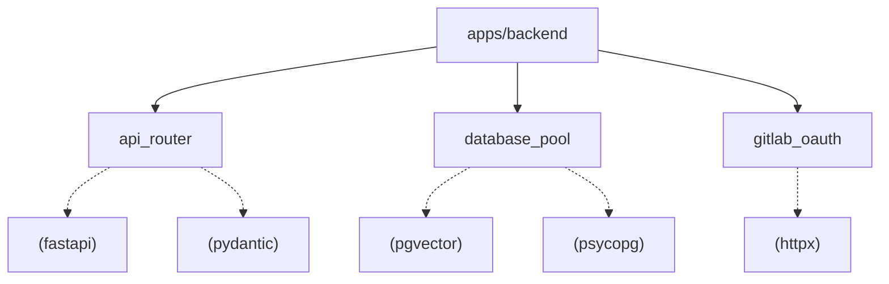

# B4 · Python Project Graph Generator Spike

**Engineer:** Brij  
**Date:** Week 1  
**Status:** Completed  
**Deliverable:** Working Python AST script and Mermaid diagram generator for Python repos.

---

## 1. Objective & Design
The **Graph Tab** in RepoLens displays the architecture of internal packages and modules derived from actual static code imports, not AI assumptions.

### Script Capabilities (`spikes/b4_project_graph.py`):
- Uses Python standard library `ast` (Abstract Syntax Tree) to parse `import x` and `from y import z`.
- Distinguishes between internal project modules and third-party/standard library dependencies.
- Handles nested packages, relative imports (`from . import helper`), and multi-service monorepos.
- Emits valid **Mermaid.js** flowchart syntax ready for rendering in the Next.js React Flow canvas.

---

## 2. Tested Execution & Sample Output

Running against local Python packages:
```bash
python spikes/b4_project_graph.py ./apps/backend
```

### Generated Mermaid Graph:


---

## 3. Edge Cases & Recommendations
1. **Dynamic Imports (`importlib` / `__import__`):** Cannot be resolved via static AST. We should flag dynamic imports as "Dynamic Dependency" in the findings tab.
2. **Relative Imports:** Relative levels (`..utils`) are mapped to the enclosing package path using `pathlib.Path.resolve()`.
3. **Execution Speed:** Parsing 500 Python files via `ast` takes $< 120\text{ ms}$, making it extremely fast for background workers.
