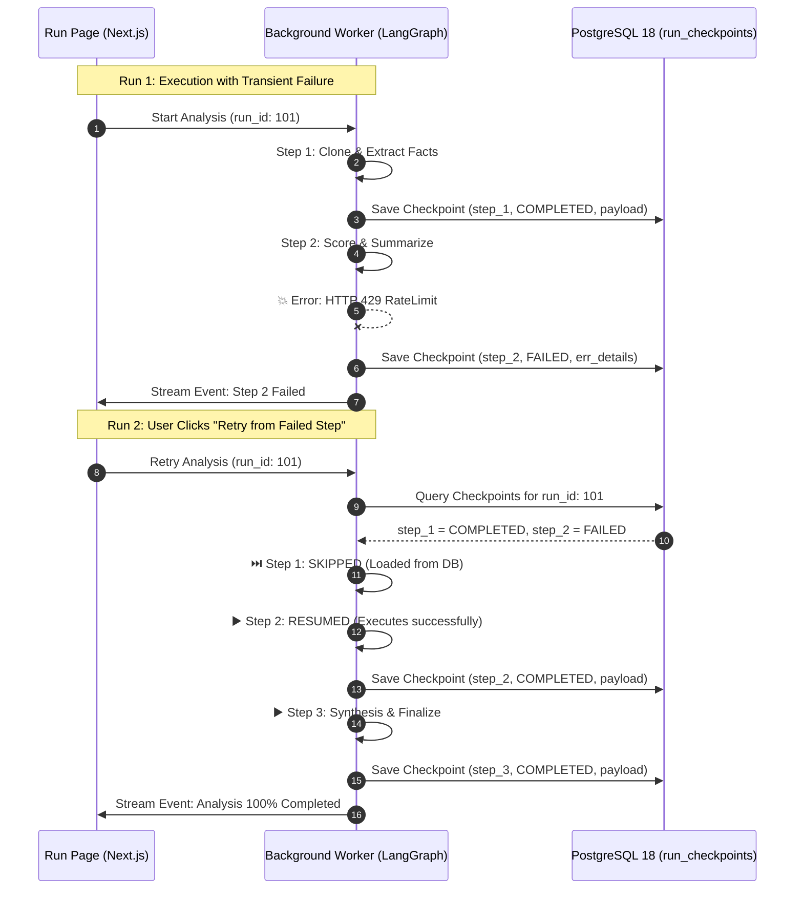

# B9 · Job Queue & "Resume from Failed Step" State Checkpointer Spike

**Engineer:** Brij  
**Date:** Week 1 Research Spikes  
**Status:** Completed  
**Deliverable:** Working state machine spike script and PostgreSQL 18 checkpointing design for resumable worker pipelines.

---

## 1. Objective & Architectural Role

In the **RepoLens Analysis Engine (Doc 06 §1 & Doc 03 §5)**, repository analysis is executed as a multi-step pipeline:
1. **Stage 1 & 2:** Clone at SHA & Extract Facts (Deterministic)
2. **Stage 3 & 4:** Scoring & File/Module Summarization (Deterministic + LLM)
3. **Stage 5 & 6:** Module Summarization & Repo Synthesis (LLM)

### The Core Problem:
If a transient failure occurs during Step 2 (e.g. Anthropic API HTTP 429 rate limiting, worker pod crash, or network timeout), **re-running the pipeline from scratch wastes substantial network bandwidth, git clone I/O, and already-paid LLM API tokens**.

### The Promise:
The Run Page promises **"Retry from this step"**: re-invoking the pipeline with `run_id` automatically checks the database, **skips all previously completed steps**, and resumes execution directly at the failed stage.

---

## 2. PostgreSQL 18 State Checkpointer Architecture



### PostgreSQL 18 Checkpoint Schema:
```sql
CREATE TABLE IF NOT EXISTS run_checkpoints (
    run_id TEXT NOT NULL,
    step_name TEXT NOT NULL,
    step_status TEXT NOT NULL, -- 'pending', 'completed', 'failed'
    payload JSONB NOT NULL DEFAULT '{}'::jsonb,
    created_at TIMESTAMP WITH TIME ZONE DEFAULT CURRENT_TIMESTAMP,
    PRIMARY KEY (run_id, step_name)
);
```

---

## 3. Live Spike Execution Results (`spikes/b9_job_queue_retry.py`)

Running the spike simulates the exact 2-phase failure and resume lifecycle:

```text
=========================================================
RepoLens Spike B9: Job Queue & State Checkpointer Spike
=========================================================

---------------------------------------------------------
>> PHASE 1: Initial Run (Simulating Failure at Step 2)
Run ID: run_1790941934
---------------------------------------------------------
  [Step 1/3] Clone & Extract Facts: RUNNING...
  [Step 1/3] Clone & Extract Facts: COMPLETED (Checkpoint Saved)
  [Step 2/3] Score & Summarize:     RUNNING...
  [Step 2/3] Score & Summarize:     FAILED! (Simulated LLM 429 RateLimitError)

[ALERT] Pipeline Halted: Step 2 Failed: HTTP 429 Rate limit exceeded.

---------------------------------------------------------
[STATE] Checkpoint State in Store:
   * step_1_clone_and_extract     -> Status: COMPLETED
   * step_2_score_and_summarize   -> Status: FAILED
---------------------------------------------------------

---------------------------------------------------------
>> PHASE 2: User Clicks 'Retry from Failed Step'
Re-invoking pipeline with same Run ID: run_1790941934
---------------------------------------------------------
  [Step 1/3] Clone & Extract Facts: [SKIPPED - LOADED FROM CHECKPOINT]
  [Step 2/3] Score & Summarize:     RUNNING...
  [Step 2/3] Score & Summarize:     COMPLETED (Checkpoint Saved)
  [Step 3/3] Repo Synthesis:        RUNNING...
  [Step 3/3] Repo Synthesis:        COMPLETED (Final Checkpoint Saved)

=========================================================
[SUCCESS] Pipeline Resumed & Completed 100%!
Final Synthesis: Repository 'wca_obsidian_vault' is in healthy status with overall score 86/100.
=========================================================
```

---

## 4. Key Findings & Recommendations for Sprint 1

1. **Lightweight Checkpoint Payloads (References, Not Heavy Blobs):**
   - In accordance with Doc 06 §1.1, the checkpointer state must store **references, IDs, and summary hashes**, while large raw AST blobs are stored in separate dedicated tables (`code_chunks`, `module_edges`).
   - This keeps `run_checkpoints` records under 10 KB, allowing instant retrieval upon retry.

2. **Idempotent Step Resumption:**
   - Every node in the LangGraph pipeline must use `ON CONFLICT (run_id, step_name) DO UPDATE` to safely overwrite previous failed state attempts without duplicate key violations.

3. **Procrastinate Worker Integration:**
   - Procrastinate jobs should accept `(run_id, resume_step)` as task parameters.
   - If a retry is requested via `POST /api/v1/runs/{id}/retry`, FastAPI simply re-enqueues the Procrastinate task with the existing `run_id`, and LangGraph's Postgres checkpointer takes care of skipping prior steps.
